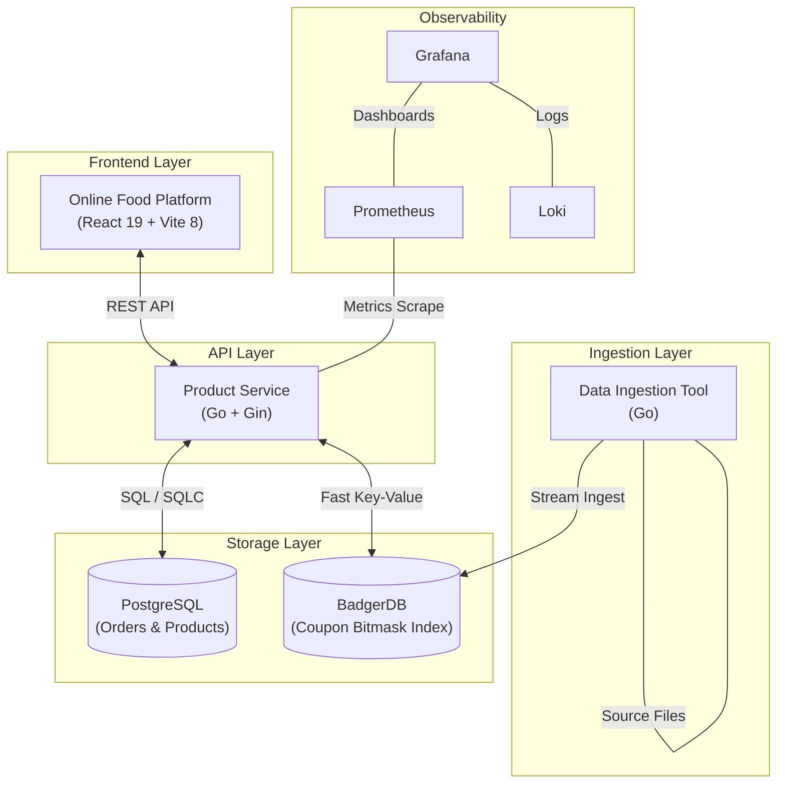

# Oolio Assignment - Online Food Ordering Platform 🍰

A professional, high-performance monorepo implementing a robust food ordering platform. This project showcases a modern full-stack architecture featuring a **React 19** frontend, a **concurrent Go** backend, and a **high-speed data ingestion pipeline**.

---

## 🏗️ Architecture Overview

The platform is designed for high throughput and scalability, utilizing specialized storage for different data access patterns.




---

## 📂 Project Structure

```text
.
├── oolio-online-food-platform/ # React 19 / TypeScript / Tailwind 4 Frontend
├── product-service/            # Go 1.26 / Gin / PostgreSQL Backend API
├── data-ingestion/             # Concurrent Go tool for Promo Code indexing
├── badger-data/                # Persistent KV storage (Shared/Shared)
└── README.md                   # You are here
```

---

## 🚀 Services & Key Features

### 1. [Online Food Platform (UI)](./oolio-online-food-platform/README.md)
- **Tech Stack**: React 19, TypeScript, Vite 8, Zustand 5, TanStack Query 5, Tailwind 4.
- **Features**: 
  - Dynamic dessert grid with optimized loading.
  - Real-time cart management with immediate feedback.
  - Interactive coupon validation integrated with backend logic.
  - Responsive, mobile-first design using Shadcn UI.

### 2. [Product Service (API)](./product-service/README.md)
- **Tech Stack**: Go 1.26, Gin, SQLC, pgx, Prometheus, Loki.
- **Features**:
  - Domain-Driven Design (DDD) with clean separation of layers.
  - Transactional order processing with pessimistic stock locking.
  - Bulk product creation and paginated listings.
  - Fully instrumented with metrics and structured logging.

### 3. [Data Ingestion Tool](./data-ingestion/README.md)
- **Tech Stack**: Go, BadgerDB, xxhash.
- **Logic**:
  - Ingests GBs of coupon data across multiple source files.
  - Uses a **Bitmask Strategy** to track cross-file occurrences efficiently.
  - Concurrent processing with 16 workers and deterministic partitioning.
  - Extreme write speed using SSD-optimized batched transactions.

---

## 📊 Monitoring & Observability

Access the pre-configured observability stack for real-time system monitoring:

| Tool | URL | Credentials |
| :--- | :--- | :--- |
| **Grafana** | [http://localhost:3000](http://localhost:3000) | `admin` / `admin` |
| **Prometheus** | [http://localhost:9091](http://localhost:9091) | Guest |
| **Loki** | [http://localhost:3100](http://localhost:3100) | Guest |

---

## 🏃 Getting Started

### Prerequisites
- **Go 1.26** & **Node.js v19+** (npm/yarn)
- **Docker & Docker Compose**
- **Make**, **Air** (Go hot-reload), and **SQLC**

### Deployment Flow

1. **Clone the Repository**:
   ```bash
   git clone https://github.com/azar-writes-code/oolio-assignment
   cd oolio-assignment
   ```

2. **Ingest Promo Data**:
   ```bash
   cd data-ingestion && make run
   ```
3. **Start Infrastructure & API**:
   ```bash
   cd product-service && make start
   ```
4. **Start Frontend**:
   ```bash
   cd oolio-online-food-platform && npm install && npm run dev
   ```

---

## 🛠️ Assignment Requirements (Advanced Challenge)

### Promo Code Validation Logic
A promo code is valid if:
- Length is between **8 and 10 characters**.
- Found in **at least two** of the provided files (`couponbase1.gz`, `couponbase2.gz`, `couponbase3.gz`).
- *The implementation uses a bitmask index for O(1) validation during checkout.*

---

**Developed for the Oolio Advanced Challenge.**
