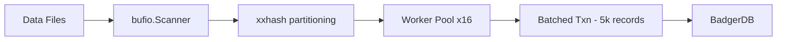

# Data Ingestion Tool

A high-performance Go-based ingestion pipeline designed to stream massive datasets into an SSD-optimized, persistent key-value store (BadgerDB). It features a concurrent, memory-efficient architecture with bitmask-based source tracking.

## Overview

The `data-ingestion` service is built to transform flat-file coupon data into a querying-ready state. It processes approximately 3GB of data across three source files, using a bitmask strategy to efficiently track which source files a coupon appears in, while maintaining a single entry per unique code.

### Core Features

- **Concurrent Architecture**: 16 partitioned workers process data streams simultaneously.
- **Memory Efficiency**: Row-by-row `bufio.Scanner` ensures the tool can process files far larger than available RAM.
- **High-Performance Persistence**: SSD-optimized BadgerDB with batched transactions (5,000 records per batch) for extreme write throughput.
- **Deterministic Distribution**: Uses `xxhash` to partition coupons among workers, ensuring minimal lock contention and high CPU utilization.

---

## Getting Started

### Prerequisites

- [Go 1.26+](https://go.dev/doc/install)
- [Make](https://www.gnu.org/software/make/) (optional but recommended)

### Step 1: Prepare Data

Ensure your coupon datasets are extracted into the `data/` folder within this directory. The pipeline expects text files with one coupon per line.

```bash
# Example extraction
gunzip couponcode_base.gz
```

### Step 2: Run Ingestion

You can start the ingestion process using the provided Makefile or directly via `go run`.

**Using Make:**
```bash
make run
```

**Using Go:**
```bash
go run cmd/ingester/main.go
```

The process will stream data from `data/` and store the index in `../badger-data`.

---

## Architectural Details

### The Pipeline



### Bitmask Strategy

To avoid redundant keys while tracking source file appearances, the tool uses a single byte per coupon with bitwise OR operations:
- **File 1**: Bit 0 (0x01)
- **File 2**: Bit 1 (0x02)
- **File 3**: Bit 2 (0x04)

If a coupon "BESTDEAL10" is found in File 1 and File 3, its final value in BadgerDB will be `0x05` (`0x01 | 0x04`).

### Performance Tuning

- **Worker Count**: 16 workers leverage multi-core architectures effectively.
- **Batch Size**: 5,000 records per transaction balances write efficiency with latency, minimizing Badger's write amplification.
- **Deterministic Worker ID**: `xxhash.Sum64String(code) % numOfWorkers` ensures no two workers conflict on the same key, reducing transaction retries.

---

## Storage Structure

The resulting database is stored in `../badger-data`.

- **Key**: `promo:<coupon_code>`
- **Value**: `1-byte bitmask` representing file sources.
